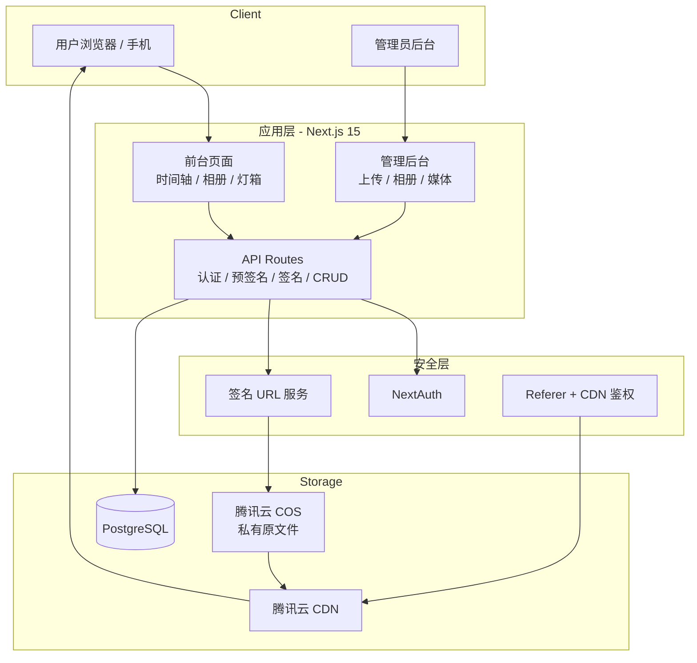

# 陈庆.我爱你 · 个人无损照片/视频相册系统

> **域名**：`陈庆.我爱你`  
> **仓库**：https://github.com/1004cq/cos  
> **定位**：高安全、原画质、可管理的个人媒体相册，专为腾讯云 COS 设计。

---

## 一、项目目标

1. **无损存储**：照片、视频以原始文件完整保存在腾讯云 COS。
2. **管理员后台**：批量上传、相册管理、媒体管理、封面设置。
3. **前台展示**：时间轴 + 相册 + 灯箱预览 + 视频播放 + 原图下载。
4. **强力防盗刷**：私有桶 + 短时效签名 URL + Referer 白名单 + CDN 鉴权 + 用量封顶。
5. **中文域名**：原生支持 `陈庆.我爱你`。

---

## 二、系统架构

### 2.1 总体架构图



### 2.2 分层职责

| 层级 | 职责 | 实现 |
|------|------|------|
| 表现层 | 页面与交互 | Next.js App Router + Tailwind + shadcn/ui |
| 应用层 | 业务编排、权限 | API Routes + Server Actions |
| 领域层 | 核心模型 | Prisma |
| 基础设施 | 存储、认证 | COS SDK、NextAuth、PostgreSQL |
| 安全层 | 防盗刷 | 私有桶 + 临时签名 + Referer + CDN |

### 2.3 核心数据流

**上传（预签名直传）**
```
管理员 → POST /api/upload/presign → 后端返回 PUT 预签名 URL
      → 前端直接 PUT 到 COS
      → POST /api/media 入库
```

**访问（强制签名）**
```
用户 → 前端请求 /api/sign → 后端校验权限后返回临时 GET 签名 URL
     → 前端用该 URL 加载图片/视频
```

---

## 三、技术栈

- **框架**：Next.js 15 (App Router) + TypeScript
- **UI**：Tailwind CSS + shadcn/ui + Lucide React
- **数据库**：PostgreSQL + Prisma
- **认证**：NextAuth.js (Credentials)
- **存储**：腾讯云 COS (`cos-nodejs-sdk-v5`)
- **部署**：Vercel 或 Docker Compose

---

## 四、数据库设计

完整 schema 见 `prisma/schema.prisma`。

主要模型：`User`、`Album`、`Media`、`ShareLink`。

---

## 五、API 接口设计

- 上传预签名：`POST /api/upload/presign`
- 媒体入库：`POST /api/media`
- 签名访问：`GET /api/sign`
- 相册 / 媒体 CRUD、分享等

---

## 六、COS 签名代码

核心逻辑已在 `lib/cos.ts` 中实现（预签名上传 + 访问签名 + key 生成）。

---

## 七、UI 页面说明

**前台**：时间轴、相册页、灯箱、分享页  
**后台**：登录、上传、相册管理、媒体库、仪表盘

---

## 八、安全配置清单（上线必做）

### 8.1 存储桶基础

| 配置项 | 推荐值 | 必做 |
|--------|--------|------|
| 访问权限 | **私有读写** | ✅ |
| 版本控制 | 开启 | 建议 |

> 路径：存储桶 → 权限管理

---

### 8.2 COS 防盗链（Referer）

**路径**：存储桶 → 安全管理 → 防盗链设置

| 配置项 | 推荐值 |
|--------|--------|
| 状态 | 开启 |
| 类型 | **白名单** |
| 空 Referer | **拒绝** |
| Referer | 见下方 |

**Referer 填写内容：**

```text
陈庆.我爱你
*.陈庆.我爱你
```

**说明：**
- `陈庆.我爱你` → 匹配主域名
- `*.陈庆.我爱你` → 匹配所有子域名
- 空 Referer 选「拒绝」可拦截直接复制链接、curl、下载工具

**验证方法：**

| 测试方式 | 预期结果 |
|----------|----------|
| 从网站页面正常访问图片 | 成功显示 |
| 直接复制图片链接到新标签页 | 返回 403 |
| curl 不带 Referer 请求 | 返回 403 |

> 本地开发可临时允许空 Referer 或加入 `localhost`，上线前必须改回。

---

### 8.3 CDN 配置（强烈推荐）

| 配置项 | 推荐值 | 说明 |
|--------|--------|------|
| 加速域名 | `陈庆.我爱你` | 绑定到 COS 源站 |
| 防盗链 | 白名单 + 拒绝空 Referer | 与 COS 保持一致 |
| URL 鉴权 | TypeA / TypeC | 额外一层签名保护 |
| 用量封顶 | 开启 | 超限返回 404，防账单爆炸 |
| HTTPS | 强制跳转 | 必须 |
| 回源鉴权 | 开启 | 私有桶必须开启 |

---

### 8.4 预签名安全

| 场景 | 推荐有效期 |
|------|------------|
| 上传预签名（PUT） | **3 ~ 10 分钟** |
| 访问预签名（GET） | **15 ~ 60 分钟** |

**额外建议：**
- 优先使用 STS 临时密钥生成签名
- 所有媒体访问必须经过后端 `/api/sign`
- 禁止前端直接拼接 COS 原始链接

---

### 8.5 监控告警

| 项目 | 建议 |
|------|------|
| 云监控 | 设置「外网下行流量」异常告警 |
| CDN 用量封顶 | 设置合理阈值并开启 |

---

### 8.6 上线前最终检查清单

```text
□ 存储桶权限 = 私有读写
□ COS 防盗链已开启（白名单 + 拒绝空 Referer）
□ Referer 已填写：陈庆.我爱你 和 *.陈庆.我爱你
□ 已验证：直接复制链接会返回 403
□ （推荐）已接入 CDN，并开启防盗链 + URL 鉴权 + 用量封顶
□ 预签名有效期已缩短（上传 ≤10分钟，访问 ≤60分钟）
□ COS_SECRET_KEY 仅存在于服务端环境变量
□ 云监控流量告警已配置
```

---

## 九、部署方案

- **Vercel**：最快上线
- **Docker Compose**：推荐自有 VPS（已提供 `docker-compose.yml`）

---

## 十、实现优先级

| 阶段 | 内容 | 状态 |
|------|------|------|
| Phase 1 | 骨架、登录、预签名上传 | ✅ 已完成 |
| Phase 2 | 相册 CRUD、前台时间轴、强制签名访问 | 待开始 |
| Phase 3 | 分享、批量操作、体验优化 | 待开始 |
| Phase 4 | 上线、监控、最终安全检查 | 待开始 |

---

## 十一、注意事项

1. `COS_SECRET_KEY` 绝对不能出现在前端或 Git。
2. 所有媒体访问必须经过 `/api/sign`。
3. 大文件务必使用预签名直传。
4. 先用测试桶验证签名和防盗链，再切生产。
5. 定期备份数据库 + COS。

---

**当前状态**：Phase 1 代码已落地，安全配置清单格式已优化。可继续推进 Phase 2。