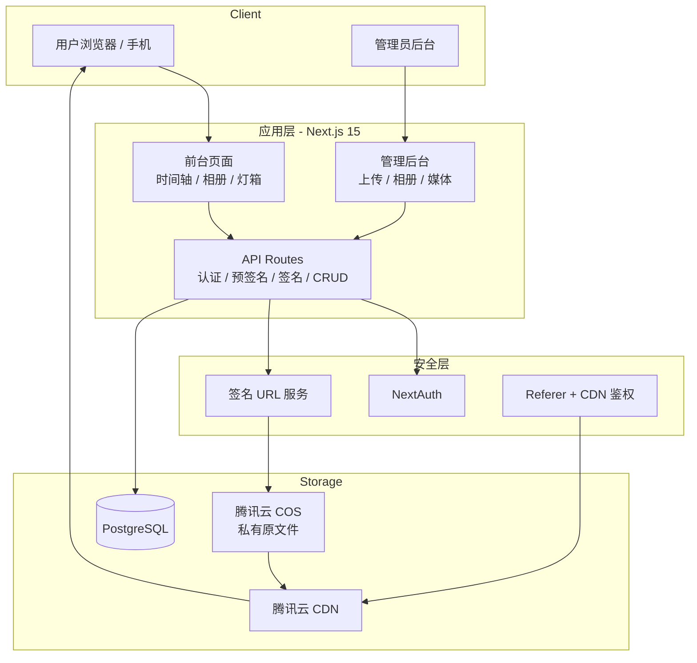

# 陈庆.我爱你 · 个人无损照片/视频相册系统

> **域名**：`陈庆.我爱你`  
> **仓库**：https://github.com/1004cq/cos  
> **定位**：高安全、原画质、可管理的个人媒体相册，专为腾讯云 COS 设计。  
> **状态**：技术方案 + 架构 + API + 签名代码 + 部署全部补充完毕，可直接交给 Cursor 实现。

---

## 一、项目目标

1. **无损存储**：照片、视频以原始文件完整保存在腾讯云 COS。
2. **管理员后台**：批量上传、相册管理、媒体管理、封面设置。
3. **前台展示**：时间轴 + 相册 + 灯箱预览 + 视频播放 + 原图下载。
4. **强力防盗刷**：私有桶 + 短时效签名 URL + Referer 白名单 + CDN 鉴权 + 用量封顶。
5. **中文域名**：原生支持 `陈庆.我爱你`。

---

## 二、系统架构

### 2.1 总体架构图



### 2.2 分层职责

| 层级 | 职责 | 实现 |
|------|------|------|
| 表现层 | 页面与交互 | Next.js App Router + Tailwind + shadcn/ui |
| 应用层 | 业务编排、权限 | API Routes + Server Actions |
| 领域层 | 核心模型 | Prisma |
| 基础设施 | 存储、认证 | COS SDK、NextAuth、PostgreSQL |
| 安全层 | 防盗刷 | 私有桶 + 临时签名 + Referer + CDN |

### 2.3 核心数据流

**上传（预签名直传）**
```
管理员 → POST /api/upload/presign → 后端返回 PUT 预签名 URL
      → 前端直接 PUT 到 COS
      → POST /api/media 入库（key、filename、size、mimeType...）
```

**访问（强制签名）**
```
用户 → 前端请求 /api/sign?key=xxx → 后端校验权限后返回临时 GET 签名 URL（默认 1 小时）
     → 前端用该 URL 加载图片/视频
```

---

## 三、技术栈（最终）

- **框架**：Next.js 15 (App Router) + TypeScript
- **UI**：Tailwind CSS + shadcn/ui + Lucide React
- **数据库**：PostgreSQL + Prisma（本地可用 SQLite）
- **认证**：NextAuth.js (Credentials)
- **存储**：腾讯云 COS (`cos-nodejs-sdk-v5`)
- **部署**：Vercel 或 Docker Compose（推荐自己 VPS）

---

## 四、数据库设计（Prisma）

完整 schema 已放在 `prisma/schema.prisma`。

主要模型：
- `User`：管理员
- `Album`：相册
- `Media`：照片/视频元数据（key 指向 COS）
- `ShareLink`：分享链接（支持密码 + 过期）

---

## 五、API 接口设计

### 认证
- `POST /api/auth/signin`（NextAuth）
- `GET /api/auth/session`

### 上传相关
- `POST /api/upload/presign`  
  Body: `{ filename: string, contentType: string, size: number }`  
  返回: `{ url: string, key: string }`（预签名 PUT 地址）

- `POST /api/media`  
  Body: `{ key, filename, mimeType, size, width?, height?, duration?, albumId?, takenAt?, tags? }`  
  入库媒体信息

### 签名访问（核心）
- `GET /api/sign?key=xxx` 或 `POST /api/sign`  
  返回: `{ url: string, expires: number }`  
  必须登录或有效分享 token 才能获取

### 相册
- `GET /api/albums`
- `POST /api/albums`
- `GET /api/albums/[id]`
- `PATCH /api/albums/[id]`
- `DELETE /api/albums/[id]`

### 媒体
- `GET /api/media`（支持分页、albumId、search、tag 过滤）
- `GET /api/media/[id]`
- `PATCH /api/media/[id]`
- `DELETE /api/media/[id]`（同时可选删除 COS 文件）

### 分享
- `POST /api/share` 创建分享链接
- `GET /api/share/[token]` 验证并返回内容（需密码时前端再提交）

所有写接口和敏感读接口都需要管理员登录态（NextAuth session）。

---

## 六、COS 签名代码示例（lib/cos.ts）

```ts
import COS from 'cos-nodejs-sdk-v5';

const cos = new COS({
  SecretId: process.env.COS_SECRET_ID!,
  SecretKey: process.env.COS_SECRET_KEY!,
});

const Bucket = process.env.COS_BUCKET!;
const Region = process.env.COS_REGION!;
const CDN = process.env.COS_CDN_DOMAIN; // 陈庆.我爱你 或 CDN 域名

/** 生成上传预签名（PUT） */
export function getUploadPresignedUrl(key: string, contentType: string, expires = 600) {
  return new Promise<{ url: string }>((resolve, reject) => {
    cos.getObjectUrl(
      {
        Bucket,
        Region,
        Key: key,
        Method: 'PUT',
        Sign: true,
        Expires: expires,
        Headers: { 'Content-Type': contentType },
      },
      (err, data) => {
        if (err) return reject(err);
        resolve({ url: data.Url });
      }
    );
  });
}

/** 生成访问签名 URL（GET），优先走 CDN 域名 */
export function getSignedUrl(key: string, expires = 3600) {
  return new Promise<string>((resolve, reject) => {
    cos.getObjectUrl(
      {
        Bucket,
        Region,
        Key: key,
        Method: 'GET',
        Sign: true,
        Expires: expires,
      },
      (err, data) => {
        if (err) return reject(err);
        let url = data.Url;
        // 如果配置了 CDN 域名，替换 host
        if (CDN) {
          const u = new URL(url);
          u.host = CDN;
          url = u.toString();
        }
        resolve(url);
      }
    );
  });
}

/** 生成对象 key（建议按日期组织） */
export function generateKey(filename: string) {
  const date = new Date();
  const y = date.getFullYear();
  const m = String(date.getMonth() + 1).padStart(2, '0');
  const d = String(date.getDate()).padStart(2, '0');
  const ext = filename.split('.').pop() || 'bin';
  const random = Math.random().toString(36).slice(2, 10);
  return `media/${y}/${m}/${d}/${Date.now()}-${random}.${ext}`;
}
```

---

## 七、UI / 页面说明（给前端参考）

### 前台
- **首页 `/`**：时间轴瀑布流 / 网格，按拍摄时间或上传时间倒序，点击进入灯箱。
- **相册页 `/album/[id]`**：该相册下的媒体网格 + 封面大图。
- **灯箱**：支持左右切换、原图下载、视频播放、键盘操作。
- **分享页 `/share/[token]`**：如果有密码则先验证，再展示内容。

### 管理后台（需登录）
- **仪表盘 `/admin`**：总媒体数、相册数、最近上传、存储占用粗略统计。
- **上传页 `/admin/upload`**：拖拽区域 + 多选 + 进度条 + 上传后可选归属相册。
- **相册管理 `/admin/albums`**：列表 + 新建/编辑/删除 + 设置封面。
- **媒体库 `/admin/media`**：表格/网格切换、搜索、筛选、批量删除、移动到相册。

风格建议：简洁深色/浅色自适应，突出图片本身，管理后台用 shadcn 的 Data Table + Dialog。

---

## 八、腾讯云 COS 配置清单（必须全部完成）

1. 存储桶权限 → **私有读写**
2. 防盗链 → 白名单 + 拒绝空 Referer  
   ```
   陈庆.我爱你
   *.陈庆.我爱你
   ```
3. （推荐）绑定 CDN，开启：
   - 防盗链（同上）
   - URL 鉴权（TypeA 或 TypeC）
   - 用量封顶
   - HTTPS
4. 云监控：外网下行流量告警
5. 密钥只放服务端环境变量

---

## 九、部署方案

### 方案 1：Vercel（最快）
1. 连接 GitHub 仓库
2. 配置环境变量
3. 添加 PostgreSQL（Vercel Postgres 或外部）
4. 部署

### 方案 2：Docker Compose（推荐自己 VPS）
已提供 `docker-compose.yml`（包含 app + postgres）。

```bash
docker compose up -d
```

记得把域名解析到服务器，并用 Caddy / Nginx 反代 + HTTPS。

---

## 十、实现优先级（Cursor 直接按此顺序）

**Phase 1 - 骨架**
1. 初始化 Next.js 15 + TS + Tailwind + shadcn + Prisma
2. 写入 `lib/cos.ts`（上面示例）
3. NextAuth 管理员登录
4. 预签名上传接口 + 上传页面

**Phase 2 - 核心**
5. 相册 CRUD
6. 媒体入库与列表
7. 前台时间轴 + 灯箱
8. `/api/sign` 强制签名访问

**Phase 3 - 完善**
9. 分享链接（密码 + 过期）
10. 批量操作、标签、搜索
11. 视频体验与响应式
12. 安全检查清单落地

**Phase 4 - 上线**
13. 域名 + HTTPS
14. 生产环境变量与 Docker/Vercel
15. 监控与用量封顶确认

---

## 十一、目录结构（最终）

```
cos/
├── app/
│   ├── (public)/
│   ├── admin/
│   ├── api/
│   ├── layout.tsx
│   └── globals.css
├── components/
├── lib/
│   ├── cos.ts              # 核心签名与上传工具
│   ├── prisma.ts
│   └── auth.ts
├── prisma/
│   ├── schema.prisma
│   └── seed.ts
├── public/
├── docker-compose.yml
├── .env.example
├── .gitignore
├── next.config.ts
├── package.json
└── README.md
```

---

## 十二、注意事项（强制）

1. `COS_SECRET_KEY` 绝对不能出现在前端或提交到 Git。
2. 所有媒体访问必须经过 `/api/sign`，禁止直接拼 COS 链接。
3. 大文件务必预签名直传。
4. 先用测试桶验证签名和防盗链，再切生产。
5. 定期备份数据库 + COS。

---

**全部补充完毕。**  
现在仓库已包含完整架构、API 设计、签名代码示例、UI 说明、部署方案和实现优先级。  
直接把仓库交给 Cursor，从 Phase 1 开始即可。